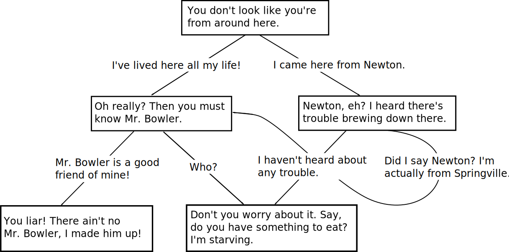

# convo
[](https://crates.io/crates/convo)
[](https://docs.rs/convo)\
[](https://travis-ci.com/simbleau/convo)
[](https://deps.rs/repo/github/simbleau/convo)

A modern dialogue executor and tree parser using YAML.

This program is the minimal crate for parsing and walking dialogue trees. A GUI implementation for editing and creating dialogue trees is coming.

# Motivation

The intent is to safely parse dialogue trees and walk complex conversations easily. Conversations resemble a traditional dialogue tree model, and can be cyclic. YAML representation makes creating dialogue trees intuitive and easy, even without a formal editor.

# State

convo is in active development. Right now only the seeds are planted.

# Using convo

convo is designed to be easy to use. At the moment the crate is **not** published. The crate will be published on [crates.io](https://crates.io/crates/convo) when it is ready. The easiest way to use convo is by adding the lone dependency to your `Cargo.toml` file:

```toml
convo = "0.0.0" # Not released
```

# Getting Started

Don't hesitate to [file an issue](https://github.com/simbleau/convo/issues/new) or contact [@simbleau](https://github.com/simbleau) by [e-mail](mailto:spencer@imbleau.com) or [@ThomasHoutart](https://github.com/ThomasHoutart) by [e-mail](mailto:thomas.houtart98@gmail.com).

This section is TODO.

# Contributing

I encourage all contributions by pull request. Please check the [issues](https://github.com/simbleau/convo/issues) first if you'd like to help.

The [Rust code of conduct](https://www.rust-lang.org/policies/code-of-conduct) applies.

# License

This  project is dual-licensed under both [Apache 2.0](https://github.com/simbleau/convo/blob/main/LICENSE-APACHE) and [MIT](https://github.com/simbleau/convo/blob/main/LICENSE-MIT) licenses.
