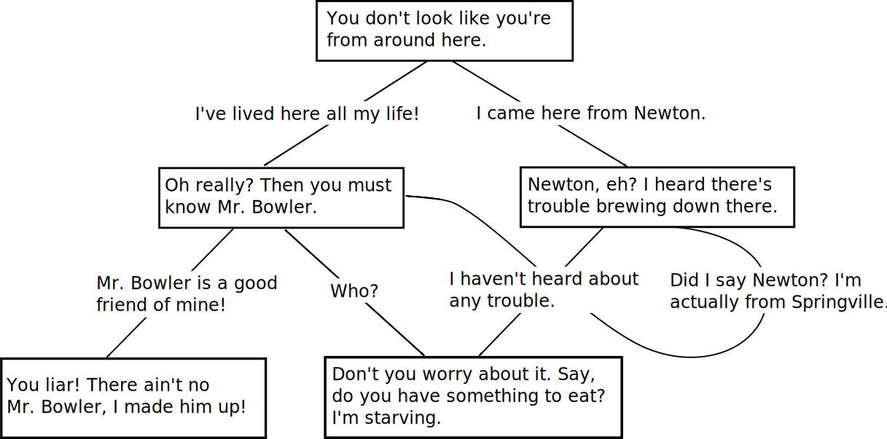

<p align="center">
    
</p>

[](https://crates.io/crates/convo)
[](https://docs.rs/convo)
[](https://travis-ci.com/simbleau/convo)
[](https://deps.rs/repo/github/simbleau/convo)

A modern dialogue executor and tree parser using [YAML](https://yaml.org/). 

This crate is for building([ex](examples/building.rs)), importing/exporting([ex](examples/io.rs)), and walking([ex](examples/walking.rs)) dialogue trees.

`convo` promises an emphasis on documentation and user-friendliness, but also performance. All retrievals, searches, and side-effects to the conversation tree are in O(1) constant time.

# Sections

- [Sections](#sections)
- [Motivation](#motivation)
- [State](#state)
- [Using convo](#using-convo)
- [Getting Started](#getting-started)
  - [Terminology](#terminology)
  - [Examples](#examples)
  - [Formatting Rules](#formatting-rules)
  - [Issues](#issues)
- [Contributing](#contributing)
  - [Help needed](#help-needed)
- [License](#license)

# Motivation

The intent is to safely import and export conversation trees, as well as walk complex conversations easily and efficiently. Conversations resemble a traditional dialogue tree model, and can be cyclic. YAML format makes creating dialogue trees intuitive and easy, even without a formal editor (but a GUI editor will come eventually).

# State

`convo` is usable and in active development. Future releases will follow [SemVer compatibility](https://doc.rust-lang.org/cargo/reference/semver.html).

# Using convo

The easiest way to use convo is by adding the lone dependency to your `Cargo.toml` file:

```toml
convo = "0.1.0"
```

# Getting Started

## Terminology

  * **Tree** - the parent container for a conversation tree.
  * **Node** - a node in a conversation tree which acts as a fork of decisions by wrapping prompting dialogue and a list of path options (called `Link`s).
  * **Link** - a uni-directional path to a [`Node`].

## Examples

Check out these important examples:
  * [Building a conversation `Tree` imperatively](examples/building.rs)
  * [Importing/Exporting `*.convo.yml` files](examples/io.rs)
  * [Walking a conversation `Tree`](examples/walking.rs)

## Formatting Rules

For specific rules and formatting information, please check [FORMATTING.md](FORMATTING.md)

## Issues

Don't hesitate to [file an issue](https://github.com/simbleau/convo/issues/new) or contact [@simbleau](https://github.com/simbleau) by [e-mail](mailto:spencer@imbleau.com) or [@ThomasHoutart](https://github.com/ThomasHoutart) by [e-mail](mailto:thomas.houtart98@gmail.com).

# Contributing

I encourage all contributions by pull request. Please check the [issues](https://github.com/simbleau/convo/issues) first if you'd like to help.

The [Rust code of conduct](https://www.rust-lang.org/policies/code-of-conduct) applies.

## Help needed

  * Create examples using the `serde-yaml` crate for serialization and deserialization.
  * Create a GUI for editing and creating convo files.

# License

This  project is dual-licensed under both [Apache 2.0](https://github.com/simbleau/convo/blob/main/LICENSE-APACHE) and [MIT](https://github.com/simbleau/convo/blob/main/LICENSE-MIT) licenses.
